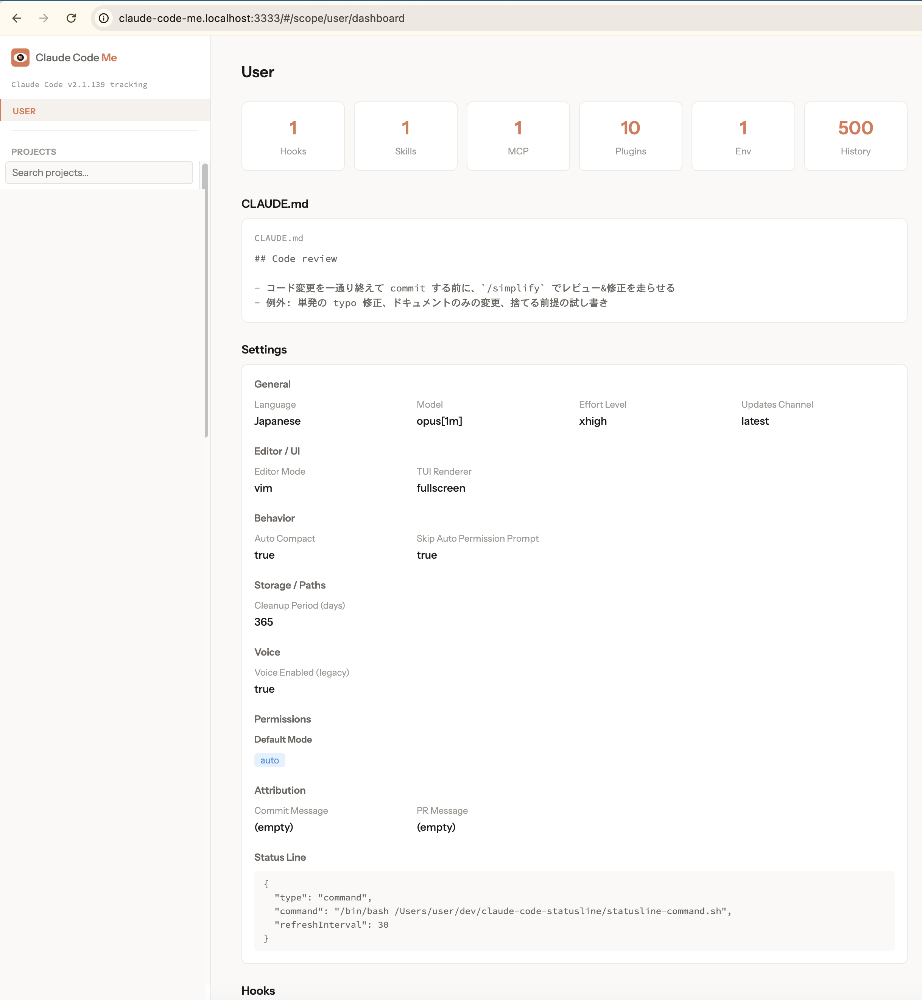
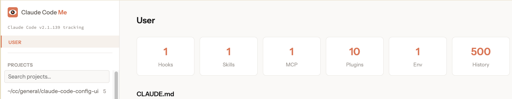
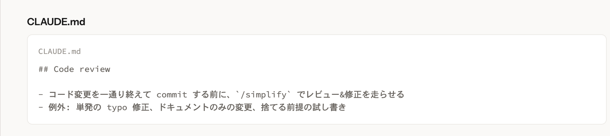
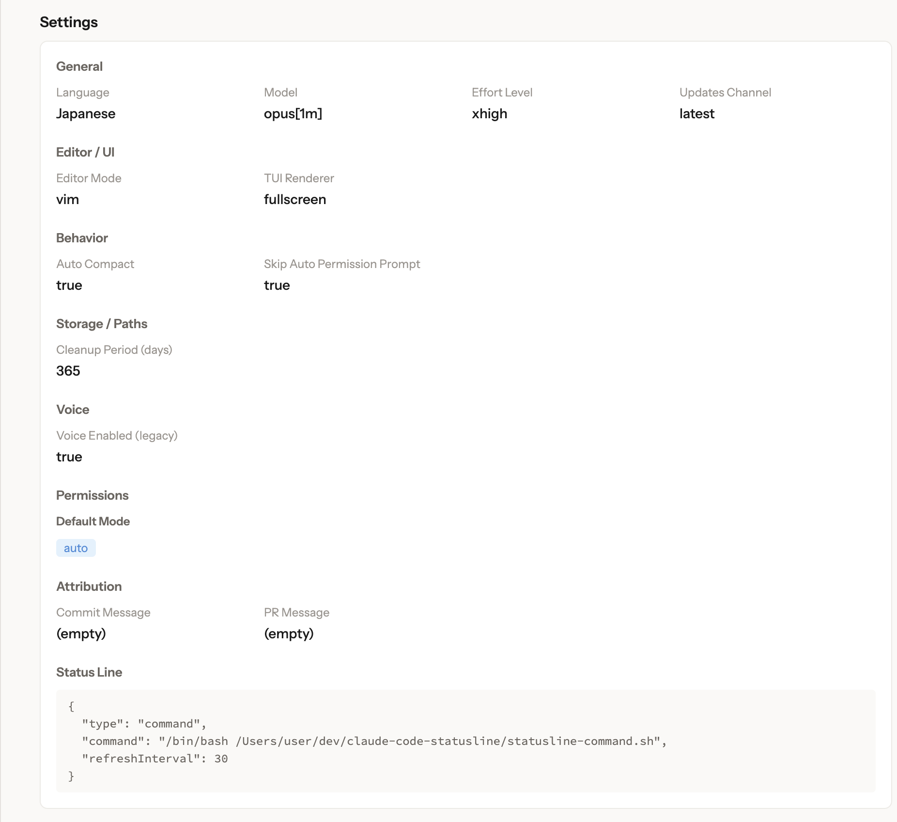
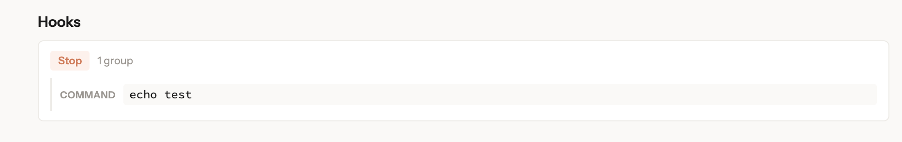
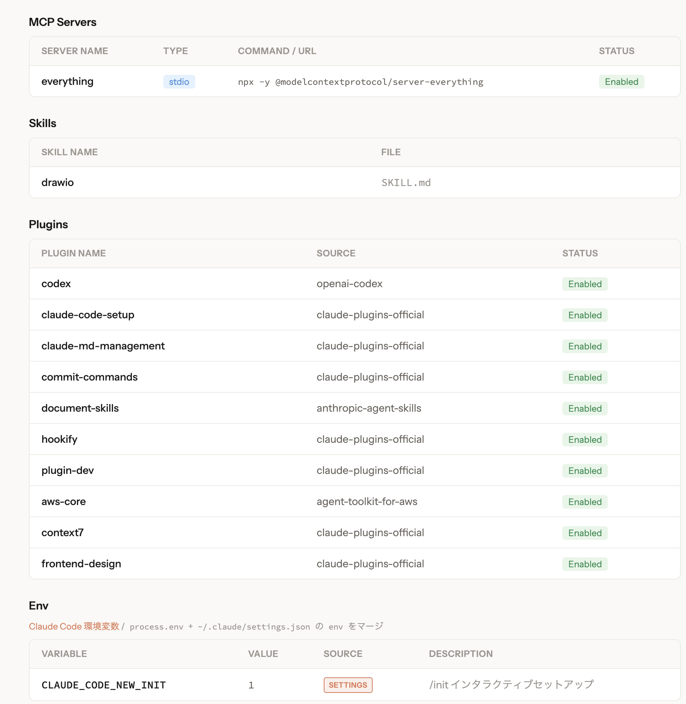
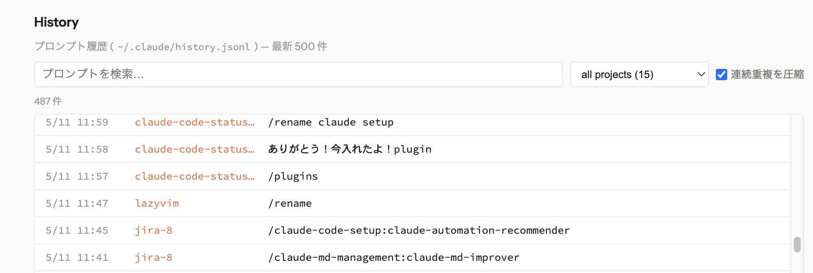
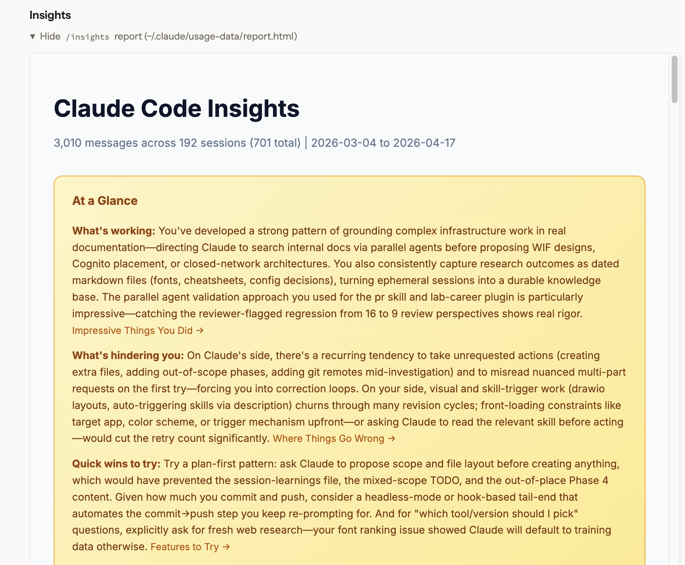
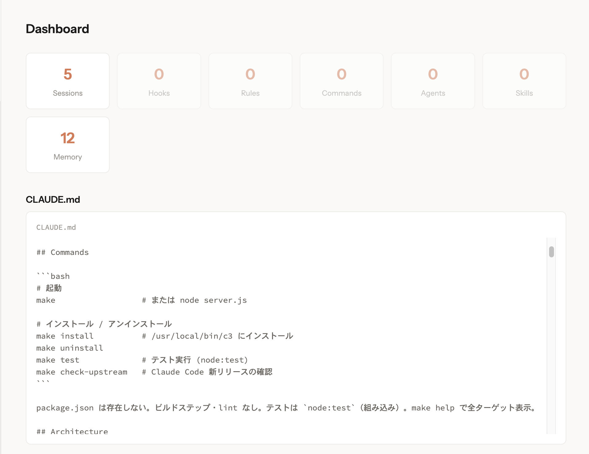

# Claude Code Me（目）

[](https://docs.anthropic.com/en/docs/claude-code)
[](https://www.typescriptlang.org/)
[](https://svelte.dev/)
[](https://hono.dev/)

> Claude Code の設定、全部俯瞰して見れる UI があればいいのに。
> Hooks 何個設定したっけ？MCP サーバーどれ繋いでたっけ？あのプロジェクトの CLAUDE.md 何書いたっけ？
>
> 「Claude Code の設定を GUI で目視確認したい」— そんな声に応えるツールです。
>
> **Me** = 目（見る）× Me（自分の Claude Code を見る）

`~/.claude/` の **読み取り専用** Web コンソール。

## Screenshots

### これが全体像

```bash
pnpm install && pnpm dev
```

これだけでブラウザが自動で開き、`~/.claude/` 配下の設定全部が **1 画面で見渡せます**。



以下、各セクションをかいつまんで紹介します。

### ① User ハブ — 全体俯瞰

サイドバーに `USER`、`PROJECTS` リスト、最新の Claude Code バージョン追従。右側に StatCard で Hooks / Skills / MCP / Plugins / Env / History の件数。



### ② CLAUDE.md — User-global の指示

`~/.claude/CLAUDE.md` の中身をそのまま埋込。



### ③ Settings — 公式 80+ field を網羅

`~/.claude/settings.json` を General / Editor / Behavior / Storage / Voice / Permissions / Attribution / Status Line とカテゴリ別に分解。設定済み項目だけ抽出。



### ④ Hooks — event ごとに何が起きるか直接表示



### ⑤ MCP / Skills / Plugins / Env

MCP サーバー、Skill、有効プラグイン、Claude Code 環境変数 (138 種をマージ表示) を縦積み。Env は **shell と `~/.claude/settings.json` の `env` をマージ**して出所バッジ付きで表示。



### ⑥ History — 16k 行のプロンプト履歴を検索

`~/.claude/history.jsonl` (Claude Code のグローバルプロンプト履歴) を最新 500 件読み、検索 + project フィルタ + 連続重複の圧縮。



### ⑦ Insights — `/insights` レポートを iframe で埋込

`~/.claude/usage-data/report.html` をそのまま読み込み。



### ⑧ Project スコープ — 同じ仕組みでプロジェクト単位も

サイドバーの対象 Project を選ぶ。



## Quick Start

```bash
git clone https://github.com/ist-j-ichikawa/claude-code-me.git
cd claude-code-me
pnpm install
pnpm dev          # ブラウザが自動で開きます
```

> **前提条件**: Node.js 18+, [Claude Code](https://docs.anthropic.com/en/docs/claude-code) がインストール済みであること（`~/.claude/` が存在すること）

## Tech Stack

| Layer           | Technology                                                                                           |
| --------------- | ---------------------------------------------------------------------------------------------------- |
| Frontend        | [Svelte 5](https://svelte.dev/) + [SvelteKit](https://svelte.dev/docs/kit/) (SPA mode, hash router)  |
| Server          | [Hono 4](https://hono.dev/) on Node.js (+ [Zod 4](https://zod.dev/) で query 検証)                    |
| Build           | [Vite 8](https://vite.dev/), [tsup](https://tsup.egoist.dev/)                                        |
| Test            | [Vitest 4](https://vitest.dev/)                                                                      |
| Language        | **TypeScript 6**                                                                                      |
| CSS             | Svelte scoped CSS + CSS custom properties                                                            |
| Design          | Anthropic-inspired (coral `#D97757`, warm beige `#FAF9F7`, Instrument Sans + Source Code Pro)        |
| Package Manager | pnpm                                                                                                 |

## Development

```bash
pnpm install
pnpm dev              # tsx watch src/server/dev.ts (Hono + Vite middleware, HMR 統合)
pnpm test             # Vitest
pnpm build            # vite build && tsup -> dist/
pnpm start            # node dist/server.mjs (built artifact)
```

dev / prod とも `claude-code-me.localhost` で起動します (起動時に自動でブラウザが開きます)。`pnpm dev` は Hono サーバーに Vite を `middlewareMode: true` で組み込み、`/api/*` を Hono、それ以外を Vite に振り分け。HMR の WebSocket も同じ HTTP server に upgrade。production (`dist/server.mjs`) は Vite を一切含まず、`serveStatic` + SPA fallback のみ。

### Directory Structure

```
src/
  server/             Hono API server (TypeScript)
    index.ts          Prod entry — Hono + serveStatic + serve()
    dev.ts            Dev entry — imports app, attaches Vite middleware
    routes.ts         Chained Hono routes (RPC type-inferred)
    scopes.ts         discoverScopes / resolveScope / CWD cache
    config.ts         buildConfig + CLAUDE.md / MCP detection
    sessions.ts       Session parsing (sessions-index.json + JSONL fallback)
    history.ts        Recent prompts from ~/.claude/history.jsonl
    env-vars.ts       Claude Code env var registry (~150 entries)
    files.ts          File serving + zone resolution + path traversal guard
    jsonl.ts          JSONL range reader + parser
    types.ts          Shared type definitions
  client/             SvelteKit SPA
    routes/           File-based routing
    lib/components/   Shared components + sections/ (hub page sections)
    lib/              API client (Hono RPC), types, design tokens
test/
  server/             Vitest server tests (incl. E2E via app.request)
dist/                 Production build output (gitignored)
  server.mjs          Bundled server (single file, shebang, ~615 KB)
  client/             Static SPA assets
```

## Security

- **読み取り専用**: 書き込み API なし
- **localhost のみ**: 外部アクセス不可。許可ディレクトリ外のファイルは読まない
